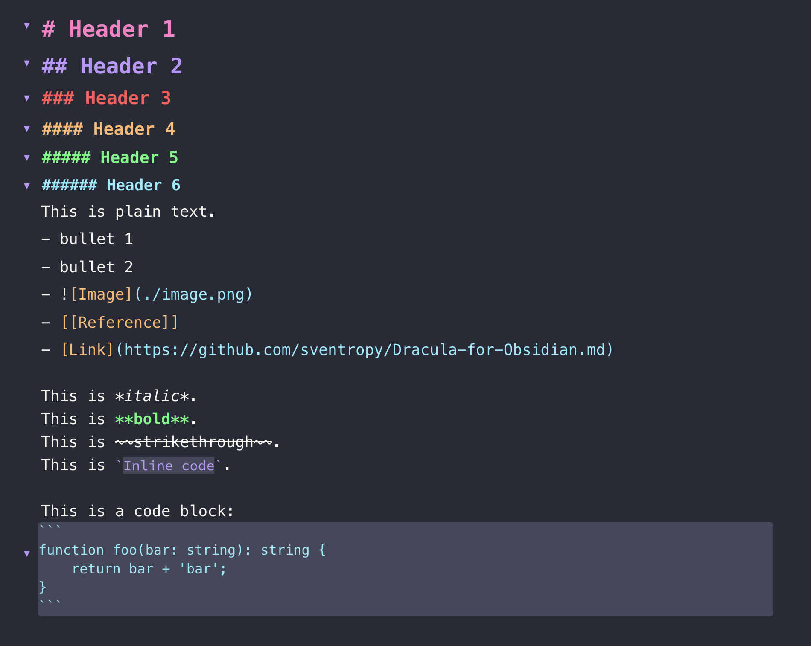

# Dracula for [Obsidian.md](https://obsidian.md)

> A dark theme for [Obsidian](https://obisidian.md), compatible to Obsidian V0.9.10

## Install

[INSTALL.md](./INSTALL)

## Creator

This theme is maintained by Sven Hennessen [Twitter](https://twitter.com/svenhennessen) based on initial work by jarodise [Twitter](https://twitter.com/jarodise)

*The CSS modification of the newest version is based on ["Pisum" by MooddooM](https://github.com/GuangluWu/obsidian-pisum)

## License

[MIT License](./LICENSE)
